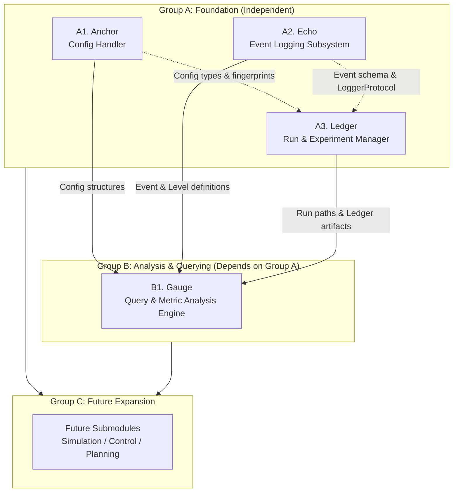

# EXPrimitives Technical & Strictly Typed API Documentation

This document provides complete, concise, legible, strictly typed API reference documentation for all existing submodules in **EXPrimitives** (`exprim`), organized into their foundational hierarchy (`Group A` and `Group B`), along with designated expansion space for future submodules (`Group C`).

---

## Inter-Submodule Dependencies & Architecture Overview



### Dependency Rules:
1. **Group A (`A1. Anchor`, `A2. Echo`, `A3. Ledger`)** is self-contained. Within Group A:
   - `Anchor` (`exprim.anchor`) operates cleanly without external runtime dependencies.
   - `Echo` (`exprim.echo`) defines atomic `Event` structures and logging sinks independently.
   - `Ledger` (`exprim.ledger`) coordinates run folders, artifacts, and metadata, using structural duck typing (`LoggerProtocol`) and optional imports for `Anchor` configs and `Echo` logs.
2. **Group B (`B1. Gauge`)** explicitly depends on **Group A**:
   - Imports `Event`, `EventType`, and `Level` directly from `exprim.echo`.
   - Resolves `Run` objects and log/metric paths managed by `exprim.ledger`.
   - Inspects parameterizations and configurations originating from `exprim.anchor`.
3. **Group C (Reserved Room for Growth)** is designated for future high-level submodules (such as simulation execution or control loops) which will depend upon both Group A and Group B.

---

## Group A: Foundation & Core Infrastructure

### A1. Anchor (`exprim.anchor`)
**Role:** Config Handler — Immutable configuration hierarchies, type-hinted definitions, validation pipelines, and multi-format serialization (`.yaml`, `.json`, `.py`).

#### 1. Core Config Base Class (`anchor.base`)
```python
from dataclasses import dataclass
from typing import Any, Callable

Resolver = Callable[[dict[str, Any]], "BaseConfig"]

@dataclass(frozen=True)
class BaseConfig:
    """
    Root mixin for all config objects. Frozen and immutable by default.
    Provides automatic hashing, equality checks, and hierarchical serialization.
    """
    def to_dict(self) -> dict[str, Any]: ...
    def fingerprint(self) -> str: ...
    def replace(self, **kwargs: Any) -> BaseConfig: ...
    @classmethod
    def from_dict(cls, d: dict[str, Any], resolver: Resolver | None = None) -> BaseConfig: ...
    def validate(self) -> list[str]: ...
    def field_names(self) -> list[str]: ...
```

#### 2. Type Aliases & Enums (`anchor.types`)
```python
from enum import Enum
from typing import Callable
from .base import BaseConfig

Seed = int
RunID = str
Hz = float
Seconds = float
CrossValidator = Callable[[BaseConfig], list[str]]

class Device(str, Enum):
    CPU = "cpu"
    CUDA = "cuda"
    MPS = "mps"

class Precision(str, Enum):
    FP32 = "float32"
    FP16 = "float16"
    BF16 = "bfloat16"
    INT8 = "int8"
    INT16 = "int16"

class LogLevel(str, Enum):
    DEBUG = "DEBUG"
    INFO = "INFO"
    WARNING = "WARNING"
    ERROR = "ERROR"
```

#### 3. Config Loading & Path Management (`anchor.loaders` & `anchor.paths`)
```python
from pathlib import Path
from typing import Any
from .base import BaseConfig, Resolver

# anchor.loaders
def load(
    path: str | Path,
    cls: type[BaseConfig],
    *,
    overrides: dict[str, Any] | None = None,
    resolver: Resolver | None = None,
    skip_validation: bool = False,
) -> BaseConfig: ...

# anchor.paths
def set_root(path: str | Path) -> None: ...
def get_root() -> Path: ...
def resolve(path: str | Path) -> Path: ...
def from_root(*parts: str) -> Path: ...
def ensure_dir(path: str | Path) -> Path: ...
```

#### 4. Multi-Format Serialization (`anchor.serialization`)
```python
from pathlib import Path
from typing import Any
from .base import BaseConfig

def save_yaml(cfg: BaseConfig, path: Path) -> None: ...
def load_yaml(path: Path, safe: bool = True) -> dict[str, Any]: ...
def save_json(cfg: BaseConfig, path: Path) -> None: ...
def load_json(path: Path) -> dict[str, Any]: ...
def save_python(cfg: BaseConfig, path: Path) -> None: ...
def load_python(path: Path) -> dict[str, Any]: ...
```

#### 5. Validation & Registration (`anchor.validation` & `anchor.registry`)
```python
from typing import Any
from .base import BaseConfig
from .types import CrossValidator

# anchor.validation
def validate(cfg: BaseConfig, *cross_validators: CrossValidator) -> None: ...

# anchor.registry
def register_config(name: str, cls: type[BaseConfig]) -> None: ...
def register_impl(name: str, cls: type[Any]) -> None: ...
def lookup_config(name: str) -> type[BaseConfig]: ...
def lookup_impl(name: str) -> type[Any]: ...
def reconstruct(d: dict[str, Any]) -> BaseConfig: ...
```

---

### A2. Echo (`exprim.echo`)
**Role:** Event Logging Subsystem — High-frequency, thread-safe, non-blocking structured event and numeric metric emission with hierarchical scoping.

#### 1. Event Definitions & Severity (`echo.event`)
```python
from dataclasses import dataclass
from enum import Enum, IntEnum
from typing import Any

class Level(IntEnum):
    DEBUG = 0
    INFO = 1
    WARNING = 2
    ERROR = 3

class EventType(Enum):
    TEXT = "text"
    METRIC = "metric"
    SCOPE = "scope"

@dataclass(frozen=True)
class Event:
    """Atomic, immutable unit of log/metric emission across Echo."""
    timestamp: float
    level: Level
    event_type: EventType
    message: str
    payload: dict[str, Any]
    run_id: str = ""
    module: str = ""
    tags: tuple[str, ...] = ()
    step: int | None = None

    def is_metric(self) -> bool: ...
    def is_text(self) -> bool: ...
    def to_dict(self) -> dict[str, Any]: ...
    @classmethod
    def now(
        cls,
        level: Level,
        event_type: EventType,
        message: str,
        payload: dict[str, Any],
        run_id: str = "",
        module: str = "",
        tags: tuple[str, ...] = (),
        step: int | None = None,
    ) -> Event: ...
```

#### 2. Primary Logger API (`echo.logger`)
```python
from contextlib import contextmanager
from typing import Any, Generator
from .event import Event, Level
from .sinks import Sink

class Logger:
    """
    Primary user-facing interface for structured logging, metric tracking, and scoping.
    """
    def __init__(
        self,
        run_id: str = "",
        module: str = "",
        sinks: list[Sink] | None = None,
        min_level: Level = Level.DEBUG,
        silent: bool = False,
    ) -> None: ...

    def emit(self, event: Event) -> None: ...
    def debug(self, message: str, *, tags: tuple[str, ...] = (), payload: dict[str, Any] | None = None) -> None: ...
    def info(self, message: str, *, tags: tuple[str, ...] = (), payload: dict[str, Any] | None = None) -> None: ...
    def warning(self, message: str, *, tags: tuple[str, ...] = (), payload: dict[str, Any] | None = None) -> None: ...
    def error(self, message: str, *, tags: tuple[str, ...] = (), payload: dict[str, Any] | None = None) -> None: ...
    
    def metric(
        self,
        name: str,
        value: float,
        *,
        step: int | None = None,
        tags: tuple[str, ...] = (),
        throttle_steps: int | None = None,
    ) -> None: ...

    @contextmanager
    def scope(self, name: str) -> Generator[None, None, None]: ...
    
    def set_step(self, step: int) -> None: ...
    def increment_step(self) -> None: ...
    def child(self, module: str) -> Logger: ...
    def stats(self) -> dict[str, int]: ...
    def flush(self) -> None: ...
    def close(self) -> None: ...
```

#### 3. Sinks, Formatter & Asynchronous(incomplete) Buffering (`echo.sinks` & `echo.formatter` & `echo.buffer`)
```python
from pathlib import Path
from typing import Protocol, runtime_checkable
from .event import Event, Level

@runtime_checkable
class Sink(Protocol):
    min_level: Level
    def emit(self, event: Event) -> None: ...
    def flush(self) -> None: ...
    def close(self) -> None: ...

class Formatter:
    def format(self, event: Event) -> str: ...
    def format_text(self, event: Event) -> str: ...
    def format_metric(self, event: Event) -> str: ...
    def format_scope(self, event: Event) -> str: ...

class ConsoleSink(Sink):
    def __init__(self, min_level: Level = Level.INFO, formatter: Formatter | None = None, silent: bool = False) -> None: ...

class FileSink(Sink):
    def __init__(self, path: Path, min_level: Level = Level.DEBUG, buffer_size: int = 0, silent: bool = False) -> None: ...

class EventBuffer:
    """Thread-safe asynchronous queue isolating simulation threads from I/O latency."""
    def __init__(self, sinks: list[Sink], maxsize: int = 10000) -> None: ...
    def start(self) -> None: ...
    def put(self, event: Event) -> None: ...
    def stop(self) -> None: ...
    def stats(self) -> dict[str, int]: ...
```

---

### A3. Ledger (`exprim.ledger`)
**Role:** Run Lifecycle & Experiment Ledger — SQLite experiment registry, standardized run directory layouts, artifact and checkpoint storage, and automated reproducibility snapshots.

#### 1. Logger Protocol & Run Handle (`ledger.run`)
```python
from pathlib import Path
from typing import Any, Protocol, runtime_checkable

@runtime_checkable
class LoggerProtocol(Protocol):
    """Duck-typed logger protocol satisfied by Echo's Logger."""
    def info(self, message: str, **kwargs: Any) -> None: ...
    def warning(self, message: str, **kwargs: Any) -> None: ...
    def error(self, message: str, **kwargs: Any) -> None: ...
    def metric(self, name: str, value: float, **kwargs: Any) -> None: ...
    def close(self) -> None: ...

class Run:
    """Central handle for managing a single experiment run's storage and lifecycle."""
    run_id: str
    run_dir: Path

    def __init__(self, run_id: str, run_dir: Path, metadata: dict[str, Any], registry: Any) -> None: ...

    @property def name(self) -> str: ...
    @property def status(self) -> str: ...
    @property def fingerprint(self) -> str: ...
    @property def tags(self) -> list[str]: ...
    @property def created_at(self) -> str: ...
    @property def logger(self) -> LoggerProtocol: ...

    def save_config(self, cfg: Any) -> None: ...
    def load_config(self) -> dict[str, Any]: ...
    def attach_logger(self, logger: LoggerProtocol) -> LoggerProtocol: ...
    def logs_path(self) -> Path: ...
    def metrics_path(self) -> Path: ...

    def save_artifact(self, source: Path, name: str | None = None, overwrite: bool = False) -> Path: ...
    def save_checkpoint(self, state: Any, step: int, overwrite: bool = False) -> Path: ...
    def checkpoint_path(self, step: int | None = None) -> Path: ...
    def list_checkpoints(self) -> list[tuple[int, Path]]: ...
    def last_step(self) -> int | None: ...
    def list_artifacts(self) -> list[Path]: ...

    def add_note(self, text: str) -> None: ...
    def read_notes(self) -> list[dict[str, str]]: ...
    def add_tags(self, tags: list[str]) -> None: ...
    def remove_tags(self, tags: list[str]) -> None: ...
    def mark_complete(self) -> None: ...
    def mark_failed(self, reason: str = "") -> None: ...
    def snapshot(self, caller_depth: int = 2) -> None: ...
    def summary(self) -> dict[str, Any]: ...
```

#### 2. Experiment Manager API (`ledger.manager`)
```python
from pathlib import Path
from typing import Any
from .run import Run

class ExperimentManager:
    """Primary entry point for managing runs and the backing SQLite registry (`ledger.db`)."""
    def __init__(self, runs_dir: Path) -> None: ...
    
    def create_run(
        self,
        cfg: Any,
        name: str | None = None,
        tags: list[str] | None = None,
        auto_snapshot: bool = True,
    ) -> Run: ...
    
    def load_run(self, run_id: str) -> Run: ...
    def list_runs(
        self,
        name: str | None = None,
        tags: list[str] | None = None,
        status: str | None = None,
        after: str | None = None,
        before: str | None = None,
    ) -> list[dict[str, Any]]: ...
    
    def find_by_fingerprint(self, fingerprint: str) -> list[dict[str, Any]]: ...
    def compare(self, run_ids: list[str], metric: str, step: int | None = None) -> list[dict[str, Any]]: ...
    def resume_run(self, run_id: str, step: int | None = None) -> tuple[Run, Path, int]: ...
    def delete_run(self, run_id: str, confirm: bool = False) -> None: ...
    def close(self) -> None: ...
    def __enter__(self) -> ExperimentManager: ...
    def __exit__(self, *_: Any) -> None: ...
```

#### 3. Directory Layouts & Snapshotting (`ledger.paths` / `ledger.snapshot` / `ledger.resume`)
```python
from pathlib import Path

# ledger.paths — directory locators
def config_dir(run_dir: Path) -> Path: ...
def logs_dir(run_dir: Path) -> Path: ...
def metrics_dir(run_dir: Path) -> Path: ...
def checkpoints_dir(run_dir: Path) -> Path: ...
def artifacts_dir(run_dir: Path) -> Path: ...
def snapshot_dir(run_dir: Path) -> Path: ...
def events_file(run_dir: Path) -> Path: ...
def metrics_file(run_dir: Path) -> Path: ...
def config_yaml(run_dir: Path) -> Path: ...
def config_json(run_dir: Path) -> Path: ...
def config_py(run_dir: Path) -> Path: ...
def metadata_file(run_dir: Path) -> Path: ...
def notes_file(run_dir: Path) -> Path: ...
def checkpoint_file(run_dir: Path, step: int) -> Path: ...
def checkpoint_latest(run_dir: Path) -> Path: ...
def ensure_run_dirs(run_dir: Path) -> None: ...

# ledger.snapshot & ledger.resume
def capture(run_dir: Path, caller_depth: int = 2) -> None: ...
def read_git_hash(run_dir: Path) -> str | None: ...
def get_resume_state(run_dir: Path, step: int | None = None) -> tuple[Path, int]: ...
def resume_note(step: int) -> str: ...
```

---

## Group B: Analysis & Querying (Depends on Group A)

### B1. Gauge (`exprim.gauge`)
**Role:** Query & Metric Analysis Engine — Single and population-level fluent queries, time series extraction, statistical profiling, scope timing trees, and multi-format exporting (`.csv`, `.json`, `.jsonl`).
**Inter-Submodule Dependencies:** Strictly requires `exprim.echo.Event`, `exprim.echo.Level`, and `exprim.echo.EventType`. Resolves `Run` instances from `exprim.ledger` using `logs_path()` and `metrics_path()`.

#### 1. Top-Level Entry Points (`gauge.__init__`)
```python
from typing import Any
from .query import Query
from .cross import CrossQuery, CrossMetrics, CrossScopes

def query(source: Any) -> Query: ...
def cross(sources: list[Any]) -> CrossQuery: ...
def metric(source: Any, name: str) -> CrossMetrics: ...
def cross_metric(sources: list[Any], name: str) -> CrossMetrics: ...
def cross_scopes(sources: list[Any]) -> CrossScopes: ...
```

#### 2. Fluent Query Interfaces (`gauge.query` & `gauge.cross`)
```python
from pathlib import Path
from typing import Any, Callable
from exprim.echo.event import Event, Level, EventType

class Query:
    """Fluent query interface for filtering events from a single run or file."""
    def __init__(self, events: list[Event]) -> None: ...
    @classmethod def from_source(cls, source: Any) -> Query: ...
    @classmethod def from_path(cls, path: Path) -> Query: ...
    
    def level(self, level: Level) -> Query: ...
    def exact_level(self, level: Level) -> Query: ...
    def event_type(self, event_type: EventType) -> Query: ...
    def steps(self, start: int, end: int) -> Query: ...
    def step_from(self, start: int) -> Query: ...
    def step_until(self, end: int) -> Query: ...
    def time_range(self, start: float, end: float) -> Query: ...
    def module(self, module: str) -> Query: ...
    def module_startswith(self, prefix: str) -> Query: ...
    def scope(self, scope: str) -> Query: ...
    def tag(self, tag: str) -> Query: ...
    def tags_any(self, tags: list[str]) -> Query: ...
    def tags_all(self, tags: list[str]) -> Query: ...
    def metric_name(self, name: str) -> Query: ...
    def metric_value(self, condition: Callable[[float], bool]) -> Query: ...
    def contains(self, substring: str) -> Query: ...
    def matches(self, pattern: str) -> Query: ...
    def fuzzy(self, keyword: str, threshold: float = 0.6) -> Query: ...
    def where(self, condition: Callable[[Event], bool]) -> Query: ...
    def not_module(self, module: str) -> Query: ...
    def not_scope(self, scope: str) -> Query: ...
    
    def collect(self) -> list[Event]: ...
    def first(self) -> Event | None: ...
    def last(self) -> Event | None: ...
    def nth(self, n: int) -> Event | None: ...
    def count(self) -> int: ...
    def context(self, event: Event, before: int = 5, after: int = 5) -> list[Event]: ...
    def surrounding(self, n: int, before: int = 5, after: int = 5) -> list[Event]: ...


class CrossQuery:
    """Fluent cross-run query interface applying filters across N runs simultaneously."""
    def __init__(self, sources: list[Any]) -> None: ...
    def level(self, level: Level) -> CrossQuery: ...
    def scope(self, scope: str) -> CrossQuery: ...
    def module(self, module: str) -> CrossQuery: ...
    def steps(self, start: int, end: int) -> CrossQuery: ...
    def contains(self, substring: str) -> CrossQuery: ...
    def metric_name(self, name: str) -> CrossQuery: ...
    def where(self, condition: Callable[[Event], bool]) -> CrossQuery: ...
    
    def per_run(self) -> dict[str, list[Event]]: ...
    def counts(self) -> dict[str, int]: ...
    def find_nth(self, n: int, match: str | None = None, scope: str | None = None, metric: str | None = None, condition: Callable[[float], bool] | None = None) -> dict[str, Event | None]: ...
    def first_occurrence(self, match: str | None = None, scope: str | None = None) -> dict[str, Event | None]: ...
    def last_occurrence(self) -> dict[str, list[Event]]: ...
    def runs_without_match(self, match: str | None = None, scope: str | None = None) -> list[str]: ...
    def runs_with_match(self, match: str | None = None, scope: str | None = None) -> list[str]: ...
```

#### 3. Population Metric & Scope Analysis (`gauge.cross` & `gauge.metrics` & `gauge.scopes`)
```python
from pathlib import Path
from typing import Any
from exprim.echo.event import Event

class CrossMetrics:
    """Population-level statistical metric analysis across N runs."""
    def __init__(self, sources: list[Any], name: str) -> None: ...
    def per_run(self) -> dict[str, list[tuple[int, float]]]: ...
    def final_values(self) -> dict[str, float | None]: ...
    def mean_across_runs(self) -> float | None: ...
    def std_across_runs(self) -> float | None: ...
    def min_across_runs(self) -> tuple[str, float] | None: ...
    def max_across_runs(self) -> tuple[str, float] | None: ...
    def percentiles(self, qs: list[float]) -> dict[float, float]: ...
    def coefficient_of_variation(self) -> float | None: ...
    def rank_by_final(self, ascending: bool = True) -> list[tuple[str, float]]: ...
    def rank_by_best(self, ascending: bool = True) -> list[tuple[str, float]]: ...
    def convergence_per_run(self, tolerance: float = 0.01, window: int = 50) -> dict[str, dict[str, Any]]: ...
    def fastest_convergence(self, tolerance: float = 0.01, window: int = 50) -> tuple[str, int] | None: ...
    def slowest_convergence(self, tolerance: float = 0.01, window: int = 50) -> tuple[str, int] | None: ...
    def outliers(self, k: float = 2.0) -> list[str]: ...
    def first_crossing_per_run(self, threshold: float, direction: str = "above") -> dict[str, tuple[int, float] | None]: ...
    def nth_crossing_per_run(self, threshold: float, n: int, direction: str = "above") -> dict[str, tuple[int, float] | None]: ...
    def envelope(self) -> dict[str, list[tuple[int, float]]]: ...
    def summary(self, percentile_intervals: list[float] = [5, 25, 50, 75, 95]) -> dict[str, Any]: ...


class CrossScopes:
    """Population-level scope timing and error profiling across N runs."""
    def __init__(self, sources: list[Any]) -> None: ...
    def entry_counts(self, scope: str) -> dict[str, int]: ...
    def mean_entry_count(self, scope: str) -> float | None: ...
    def mean_duration(self, scope: str) -> float | None: ...
    def slowest_run(self, scope: str) -> tuple[str, float] | None: ...
    def nth_entry_per_run(self, scope: str, n: int) -> dict[str, Event | None]: ...
    def runs_with_errors_in_scope(self, scope: str) -> list[str]: ...
    def runs_never_entered_scope(self, scope: str) -> list[str]: ...
    def runs_entered_more_than(self, scope: str, n: int) -> list[str]: ...
    def timing_report(self, scope: str) -> dict[str, Any]: ...

# gauge.metrics — time series extraction & math utilities
def extract(events: list[Event], name: str) -> list[tuple[int, float]]: ...
def extract_from_source(source: object | Path, name: str) -> list[tuple[int, float]]: ...
def values(series: list[tuple[int, float]]) -> list[float]: ...
def steps(series: list[tuple[int, float]]) -> list[int]: ...
def downsample(series: list[tuple[int, float]], every: int) -> list[tuple[int, float]]: ...
def rolling_mean(series: list[tuple[int, float]], window: int) -> list[tuple[int, float]]: ...
def rolling_std(series: list[tuple[int, float]], window: int) -> list[tuple[int, float]]: ...
def rolling_min(series: list[tuple[int, float]], window: int) -> list[tuple[int, float]]: ...
def rolling_max(series: list[tuple[int, float]], window: int) -> list[tuple[int, float]]: ...
def ema(series: list[tuple[int, float]], alpha: float = 0.1) -> list[tuple[int, float]]: ...
def mean(series: list[tuple[int, float]]) -> float | None: ...
def std(series: list[tuple[int, float]]) -> float | None: ...
def minimum(series: list[tuple[int, float]]) -> tuple[int, float] | None: ...
def maximum(series: list[tuple[int, float]]) -> tuple[int, float] | None: ...
def final(series: list[tuple[int, float]]) -> tuple[int, float] | None: ...
def integral(series: list[tuple[int, float]]) -> float: ...
def first_crossing(series: list[tuple[int, float]], threshold: float, direction: str = "above") -> tuple[int, float] | None: ...
def nth_crossing(series: list[tuple[int, float]], threshold: float, n: int, direction: str = "above") -> tuple[int, float] | None: ...
def converged(series: list[tuple[int, float]], tolerance: float, window: int) -> tuple[bool, int | None]: ...
def diverged_after_convergence(series: list[tuple[int, float]], tolerance: float, window: int) -> bool: ...
def spikes(series: list[tuple[int, float]], k: float = 3.0) -> list[tuple[int, float]]: ...
def nans(series: list[tuple[int, float]]) -> list[tuple[int, float]]: ...
def infs(series: list[tuple[int, float]]) -> list[tuple[int, float]]: ...
def summary(series: list[tuple[int, float]], name: str = "") -> dict[str, Any]: ...

# gauge.scopes — scope inspection utilities
def all_scope_names(events: list[Event]) -> list[str]: ...
def scope_entries(events: list[Event], scope: str) -> list[Event]: ...
def scope_exits(events: list[Event], scope: str) -> list[Event]: ...
def nth_entry(events: list[Event], scope: str, n: int) -> Event | None: ...
def entry_count(events: list[Event], scope: str) -> int: ...
def scope_durations(events: list[Event], scope: str) -> list[float]: ...
def mean_duration(events: list[Event], scope: str) -> float | None: ...
def total_duration(events: list[Event], scope: str) -> float: ...
def slowest_execution(events: list[Event], scope: str) -> float | None: ...
def fastest_execution(events: list[Event], scope: str) -> float | None: ...
def events_inside_scope(events: list[Event], scope: str) -> list[Event]: ...
def errors_inside_scope(events: list[Event], scope: str) -> list[Event]: ...
def warnings_inside_scope(events: list[Event], scope: str) -> list[Event]: ...
def scope_had_errors(events: list[Event], scope: str) -> bool: ...
def timing_report(events: list[Event]) -> list[dict[str, Any]]: ...
def call_tree(events: list[Event]) -> dict[str, Any]: ...
```

#### 4. Reports, File Readers & Export Utilities (`gauge.report`, `gauge.reader`, `gauge.export`)
```python
from pathlib import Path
from typing import Any, Generator
from exprim.echo.event import Event

# gauge.report
def run_summary(source: Any, metric_names: list[str] | None = None) -> dict[str, Any]: ...
def error_report(source: Any) -> list[dict[str, Any]]: ...
def warning_report(source: Any) -> list[dict[str, Any]]: ...
def convergence_report(source: Any, metrics: list[str], tolerance: float = 0.01, window: int = 50) -> list[dict[str, Any]]: ...
def cross_run_table(sources: list[Any], metric_names: list[str]) -> list[dict[str, Any]]: ...
def population_summary(sources: list[Any], metric_names: list[str], tolerance: float = 0.01, window: int = 50) -> dict[str, Any]: ...

# gauge.reader
def load_events(path: Path) -> list[Event]: ...
def stream_events(path: Path) -> Generator[Event, None, None]: ...
def load_metrics(path: Path) -> list[Event]: ...
def load_text(path: Path) -> list[Event]: ...
def load_scopes(path: Path) -> list[Event]: ...
def load_warnings(path: Path) -> list[Event]: ...
def load_errors(path: Path) -> list[Event]: ...
def tail_events(path: Path, n: int = 100) -> list[Event]: ...
def resolve_paths(source: Path | object) -> tuple[Path, Path]: ...

# gauge.export
def events_to_jsonl(events: list[Event], path: Path) -> None: ...
def series_to_csv(series: list[tuple[int, float]], path: Path, name: str = "value") -> None: ...
def multi_series_to_csv(series_dict: dict[str, list[tuple[int, float]]], path: Path) -> None: ...
def table_to_csv(rows: list[dict[str, Any]], path: Path) -> None: ...
def summary_to_json(summary: dict[str, Any], path: Path) -> None: ...
```

---

## Group C: Future Expansion & Domain Modules

*(Reserved area for future submodules building on Group A and Group B infrastructure)*

### C1. Reserved (`exprim.frame` / `exprim.guide` / ...)
```python
# Future simulation execution, stepping loops, and active control interfaces
# will be documented here with strict type definitions upon implementation.
```
